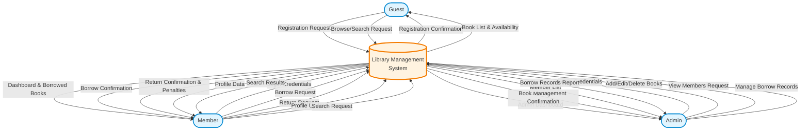
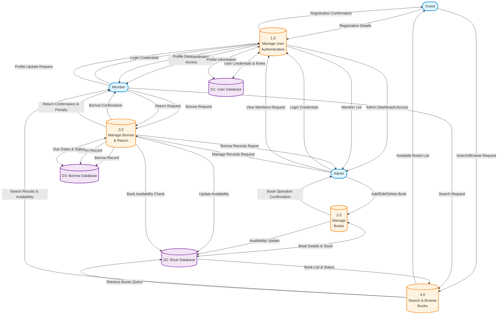

# 📊 Data Flow Diagram (DFD)
## Library Management System

---

## 📌 System Overview

The **Library Management System** is a Laravel-based web application that enables:
- **Guests** to register, browse available books, and search library content
- **Members** to log in, borrow and return books, view their dashboard, and manage their profile
- **Admins** to log in, add/edit/delete books, view all members, and manage borrow records

---

## 🔍 Context Level DFD (Level 0)

The Context Level DFD shows the Library Management System as a single process interacting with three external entities: Guest, Member, and Admin.

---

## 📋 Level 1 DFD (Expanded Process Details)

The Level 1 DFD breaks down the Library Management System into four main processes, showing detailed data flows between external entities, processes, and data stores.

---

## 📝 Detailed Process Descriptions

### 1.0 Manage User Authentication
**Sub-processes:**
- **1.1** Authenticate user credentials against User Database
- **1.2** Validate user role (Admin, Member, or Guest)
- **1.3** Create and update user session
- **1.4** Handle registration of new users
- **1.5** Manage user profile updates

**Data Inputs:**
- Login credentials (email, password)
- Registration details (name, email, password)
- Profile update information

**Data Outputs:**
- Authentication confirmation
- Session tokens
- User role and permissions
- Profile data

**Data Stores Accessed:**
- D1: User Database (read/write)

---

### 2.0 Manage Books
**Sub-processes:**
- **2.1** Add new book details to Book Database
- **2.2** Edit existing book records
- **2.3** Delete book entries
- **2.4** Update stock availability and total copies
- **2.5** Validate book information

**Data Inputs:**
- Book details (title, author, category, ISBN)
- Stock information (total copies, available copies)
- Edit/delete requests from Admin

**Data Outputs:**
- Book operation confirmations
- Updated book availability status
- Error messages for validation failures

**Data Stores Accessed:**
- D2: Book Database (read/write)

---

### 3.0 Manage Borrow and Return
**Sub-processes:**
- **3.1** Record borrow request with member and book details
- **3.2** Calculate and set due date
- **3.3** Update book availability in Book Database
- **3.4** Process return request
- **3.5** Calculate penalties for overdue returns
- **3.6** Update borrow status to 'returned'
- **3.7** Restore book availability

**Data Inputs:**
- Borrow request (member ID, book ID)
- Return request (borrow ID, return date)
- Current date for penalty calculation

**Data Outputs:**
- Borrow confirmation with due date
- Return confirmation
- Penalty amount (if applicable)
- Updated borrow records

**Data Stores Accessed:**
- D2: Book Database (read/write for availability)
- D3: Borrow Database (read/write for transactions)

---

### 4.0 Search and Browse Books
**Sub-processes:**
- **4.1** Retrieve books from Book Database
- **4.2** Filter by category, title, or author
- **4.3** Display availability status
- **4.4** Sort results by relevance or other criteria
- **4.5** Paginate results for better user experience

**Data Inputs:**
- Search query (title, author, category)
- Filter criteria
- Sort preferences

**Data Outputs:**
- List of matching books
- Book availability status
- Book details (title, author, category, copies available)

**Data Stores Accessed:**
- D2: Book Database (read-only)

---

## 📊 Data Stores Specification

### D1: User Database
**Description:** Stores all user-related information including credentials, roles, and profile data.

**Data Elements:**
- User ID (Primary Key)
- Name
- Email (Unique)
- Password (Hashed)
- Role (Admin, Member)
- Registration Date
- Last Login
- Profile Information

**Operations:**
- Create new user (Registration)
- Authenticate user (Login)
- Update profile
- Retrieve user list (Admin only)

---

### D2: Book Database
**Description:** Stores comprehensive book information and inventory status.

**Data Elements:**
- Book ID (Primary Key)
- Title
- Author
- Category/Genre
- ISBN (Optional)
- Total Copies
- Available Copies
- Publication Year
- Description
- Created Date
- Updated Date

**Operations:**
- Add new book (Admin)
- Update book details (Admin)
- Delete book (Admin)
- Retrieve book list (All users)
- Search books (All users)
- Update availability (System)

---

### D3: Borrow Database
**Description:** Tracks all borrow and return transactions with associated dates and status.

**Data Elements:**
- Borrow ID (Primary Key)
- User ID (Foreign Key to D1)
- Book ID (Foreign Key to D2)
- Borrow Date
- Due Date
- Return Date (Nullable)
- Status (Borrowed, Returned, Overdue)
- Penalty Amount (if applicable)
- Created Date
- Updated Date

**Operations:**
- Create borrow record (When member borrows)
- Update status to returned (When member returns)
- Calculate penalties (For overdue returns)
- Retrieve borrow history (Member/Admin)
- Generate reports (Admin)

---

## 🔄 Data Flow Descriptions

### External Entity to Process Flows

| From | To | Data Flow | Description |
|------|-----|-----------|-------------|
| Guest | P1 | Registration Details | Guest submits name, email, password to register |
| Guest | P4 | Search/Browse Request | Guest requests to view or search books |
| Member | P1 | Login Credentials | Member provides email and password to login |
| Member | P3 | Borrow Request | Member requests to borrow a specific book |
| Member | P3 | Return Request | Member submits return for a borrowed book |
| Member | P4 | Search Request | Member searches for books by title, author, or category |
| Admin | P1 | Login Credentials | Admin provides credentials to access admin panel |
| Admin | P2 | Add/Edit/Delete Book | Admin manages book inventory |
| Admin | P3 | Manage Records Request | Admin requests borrow/return records |

### Process to Data Store Flows

| From | To | Data Flow | Description |
|------|-----|-----------|-------------|
| P1 | D1 | User Credentials | Store new user registration data |
| D1 | P1 | User Profile & Role | Retrieve user information for authentication |
| P2 | D2 | Book Details | Store new or updated book information |
| D2 | P2 | Book Records | Retrieve book data for editing or deletion |
| P3 | D3 | Borrow Record | Create new borrow transaction |
| P3 | D3 | Return Record | Update transaction status to returned |
| D3 | P3 | Borrow History | Retrieve user's borrow records |
| P3 | D2 | Availability Update | Decrease/increase available copies |
| D2 | P4 | Book List | Retrieve books matching search criteria |

### Process to External Entity Flows

| From | To | Data Flow | Description |
|------|-----|-----------|-------------|
| P1 | Guest | Registration Confirmation | Confirm successful account creation |
| P4 | Guest | Available Books List | Display books with availability status |
| P1 | Member | Session & Dashboard | Provide access to member dashboard |
| P3 | Member | Borrow Confirmation | Confirm book checkout with due date |
| P3 | Member | Return Confirmation | Confirm book return and show any penalties |
| P4 | Member | Search Results | Display filtered and sorted book results |
| P1 | Admin | Admin Dashboard | Provide access to admin panel |
| P2 | Admin | Operation Confirmation | Confirm book add/edit/delete operation |
| P3 | Admin | Borrow Records Report | Display all borrow/return transactions |

---

## 🎯 Key Features Illustrated in DFD

1. **Multi-role Authentication System**
   - Separate access levels for Guest, Member, and Admin
   - Role-based authorization handled by Process 1.0

2. **Book Inventory Management**
   - Complete CRUD operations for books (Admin only)
   - Real-time availability tracking
   - Managed by Process 2.0

3. **Borrow/Return Transaction System**
   - Automatic due date calculation
   - Penalty calculation for overdue returns
   - Availability synchronization with Book Database
   - Managed by Process 3.0

4. **Search and Browse Functionality**
   - Available to both Guests and Members
   - Multiple filter options (title, author, category)
   - Real-time availability display
   - Managed by Process 4.0

---

## 📚 References

This Data Flow Diagram follows standard DFD notation conventions:
- **Circles/Rounded rectangles** represent processes
- **Rectangles** represent external entities
- **Open rectangles/Parallel lines** represent data stores
- **Arrows** represent data flows with labeled descriptions

The diagram provides a clear visualization of:
- How data moves through the Library Management System
- Interactions between users and the system
- Relationships between processes and data stores
- The flow of information from input to output

---

**Document Version:** 1.0  
**Last Updated:** October 17, 2025  
**System:** Library Management System (Laravel)
