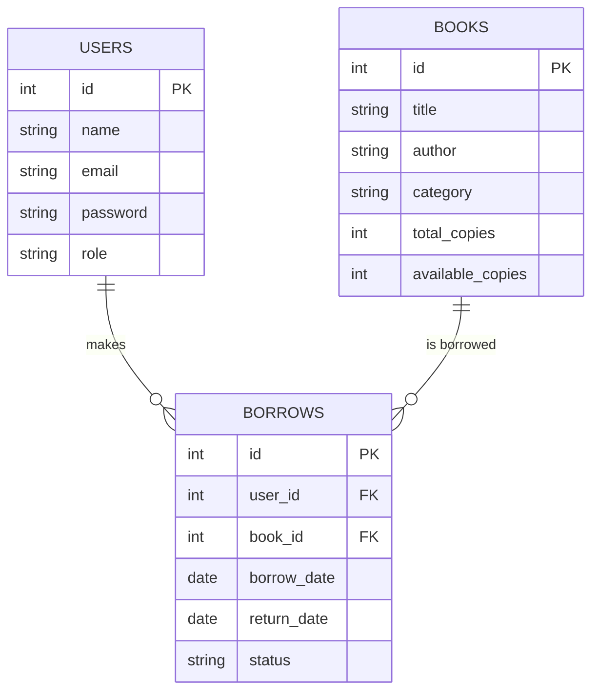

# 📚 Library Management System (Laravel)

## 📌 Overview
A minimal **Library Management System** built with **Laravel**.  
The system allows admins to manage books and users to borrow/return books.  

This is a simple team project (0.75 credit), focusing on core features rather than a full-fledged system.  

---

## 🚀 Features
- **Authentication**
  - Admin login (default Laravel auth)
  - (Optional) Normal user login

- **Book Management (Admin)**
  - Add, update, delete, and view all books

- **Borrow/Return Management**
  - Borrow book (assign user → book)
  - Return book (mark as returned)
  - Show borrowed books list

- **User Management (Optional)**
  - Admin can view all registered users
  - Users can see their borrowed books

---

## 🗄️ ER Diagram

---

## 📊 Data Flow Diagram (DFD)

For a comprehensive understanding of how data flows through the Library Management System, please refer to the **[Data Flow Diagram Documentation](DFD.md)**.

The DFD documentation includes:
- **Context Level DFD (Level 0)** - System overview with external entities
- **Level 1 DFD** - Detailed process breakdown showing:
  - Manage User Authentication
  - Manage Books
  - Manage Borrow & Return
  - Search & Browse Books
- Detailed process descriptions and data store specifications

---

## 👥 Work Distribution
- **Teammate 1** → Database (migrations, models, relationships)  
- **Teammate 2** → Controllers & Routes (Book CRUD, Borrow/Return)  
- **Teammate 3** → Blade Templates (Bootstrap UI, forms & tables)  

---

## 📝 Report Guidelines
- **Objectives** → Build a basic library system with borrowing/returning features  
- **Introduction** → Explain Laravel MVC and why chosen  
- **Methodology** → Database schema, migrations, controllers, UI  
- **Testing** → Verify CRUD operations & borrow/return workflow  
- **Conclusion** → Functional system, extendable (e.g., add search, categories, etc.)  

---

✅ This project is lightweight but demonstrates **teamwork, Laravel basics, and database handling**.  
